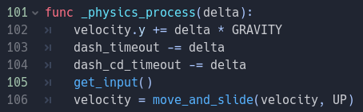

> Haikal Rahman - 200697891  
> Game Development  
> Tutorial 3  

# Latihan: Pergerakan Horizontal Menggunakan Script
Pergerakan horizontal dilakukan di dalam fungsi `get_input()`. Pergerakan ini dipisah dalam berbagai conditional `if` yang menangkap input. Satu pergerakan horizontal juga, conditional `if` tersebut juga dibagi menjadi conditional yang mengatur pergerakan dan yang mengatur animasi.

### Inisialisasi Variabel
Variabel-variabel awal ini secara konsisten diubah dan ditambahkan bergantung keperluan.

Variabel ini termasuk speed, dash_intensity, jump_speed, GRAVITY, dan lain sebagainya yang menentukan *kehalusan (smoothnes)* pergerakan. 

Bukan hanya itu, terdapat juga variabel waktu, seperti DASH_DELAY dan DASH_COOLDOWN, yang menentukan interval waktu *double-tap*, serta *cooldown* dari dash itu sendiri.

### Pergerakan Horizontal
 
Bagian Kode ini merupakan bagian kode pergerakan ke kanan dan kiri. Pada bagian kode tersebut, terdapat perintah untuk membalik posisi *sprite* untuk mengarah ke arah pergerakan.

 
Bagian ini menenttukan animasi pergerakan horizontal, termasuk pergerakan idle jika tombol kanan dan kiri tidak ditekan. Perlu diketahui bahwa animasi ini hanya dijalankan jika *player* berada di lantai atau di suatu platform.

### Pergerakan Vertikal (*Jump*, *Double Jump*, dan *Crouch*)
 
Kode ini merepresentasikan kemampuan *player* untuk melakukan *jump* dan *double jump*. Jump pertama hanya dapat dilakukan jika player berada di lantai atau platform. *Jump* kedua dapat dilakukan ketika *player* berada di udara. Kondisi tersebut direpresentasikan dalam tiga tipe `jump_state` yang sudah tertulis pada komentar tersebut. 

 
Implementasi *crouch* sendiri dilakukan jika player berada pada lantai atau *platform*. Jika tombol *crouch* ditekan atau ditahan, animasi *crouch* dijalankan (selagi tidak berada di atas udara, yang mana animasi jump dijalankan) dan *movement speed* nya dikurangi menjadi `0.2`. 

> Kurang lebih, animasi pergerakan *player*, didesain untuk memiliki prioritas tertentu, yaitu *jump* atau *double jump*, lalu *crouch*, lalu *walk*, lalu *idle*.

# Latihan: Implementasi Physics Sederhana
 
Implementasi *physics* dilakukan kurang lebih sama dengan apa yang dicontohkan oleh tutorial (gravitasi, pengambilan input, dan pergerakan dengan *collision*). Tambahan dilakukan pada `dash_timeout` dan `dash_cd_timeout` yang merupakan hitung mundur *double tap* (hitung mundur tap yang terhitung sebagai *double tap*) dan *dash* (hitung mundur untuk *cooldown* antar-dash agar tidak dispam.)

# Latihan: Implementasi Sound Effect
 
Implementasi Sound Effect dilakukan dengan menambahkan objek `AudioStreamPlayer` (audio merata, bukan audio *spatial*). Audio ini hanya  diimplementasikan pada *dash*. Akan tetapi, implementasinya masih *bugged* di mana jika di-*spam* akan memainkan audio tersebut berulang-ulang tanpa henti.